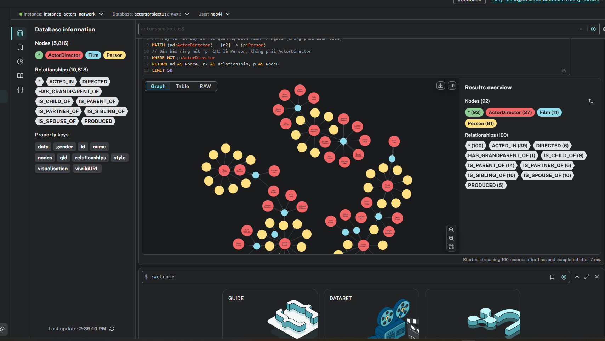
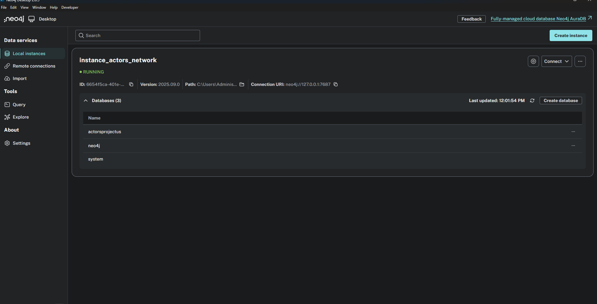
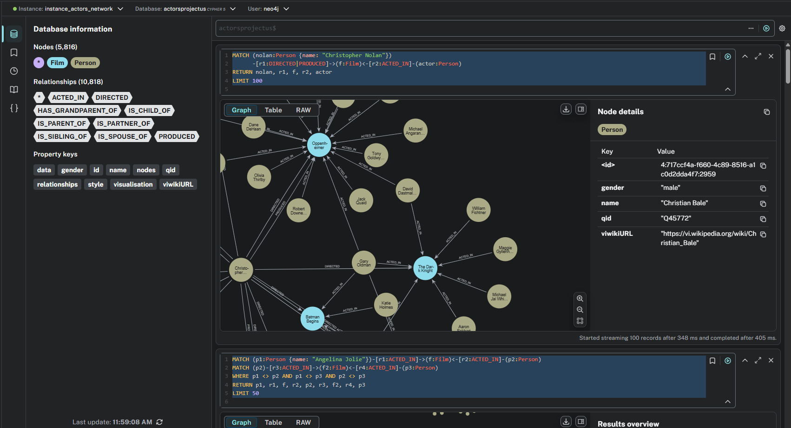

# Bài toán xây duwgng mạng lưới diễn viên đạo diễn quốc tịch Hoa Kỳ

## Quy trình truy vấn và tổ chức dữ liệu:
Thực hiện truy vấn dữ liệu bằng lệnh Sparql trên Wikidata: (https://query.wikidata.org/)

Bước 1:
1_run_discovery.py: Thực hiện lấy danh sách các diễn viên, đạo diễn Nam/Nữ của nước mỹ, độ tuổi sinh năm 1940 đến 2015 (chia ra từng phase độ tuổi đảm bảo giới hạn truy vấn mỗi lân). Kết quả thu được  1305 nhân vật nam và 884 nhân vật nữ

Bước 2:
2_run_extraction.py: Thực hiện chuyển đổi và tổ chức lại cấu trúc json thô từ bước truy vấn dữ liệu, lọc bỏ dữ liệu trùng nhau. Kết quả thu được có 1799 nhân vật.(output\all_actors_infoboxes.json)

Bước 3:
3_filter_actors.py: Bước lọc cuối cùng, mục tiêu là lọc các nhân vật có nhãn nghề nghiệp và diễn viên/đạo diễn nhưng không tham gia bất kỳ tác phẩm phim nào. Bộ dữ liệu cuối cùng thu được có 1264 nhân vật (output\all_actors_infoboxes_FILTERED.json)

Bước 4:
4_import_to_neo4j.py: Thực hiện tạo đồ thị(node và quan hệ) và lưu vào Neo4j. 

## Chú thích: 
- file utils.py dùng để thiết lập các câu hình với hàm sử dụng cơ bản
- Mã Q(id): Mã định dang duy nhất cho thực thể.
- Mã P(id): Mã định danh thông tin/quan hệ.
- Một vài lệnh để truy vấn trên đồ thị được lưu trong some-script.cpl
- tất cả con người đều có nhãn Person (nhãn màu vàng), nếu là diễn viên/đạo diễn thì có thêm nhãn ActorDirector (màu đỏ), nhã film có màu xanh dương
- Import cấu hình màu cho các node bằng file ne4j_style_2025-10-27.grass (nếu không làm thì màu của actordirector sẽ bị dùng chung với Person): gõ lệnh truy vấn ":style" để import

